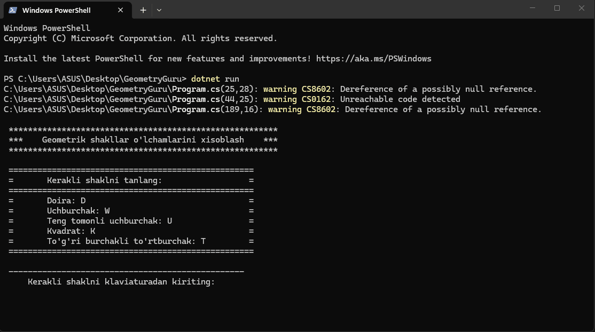

# GeometryGuru

Geometriya fanini yaxshi biladigan console loyihasi. Istalgan bir nechta formulalarni kirib qoyasiz. Foydalanuvchi birini tanlaydi va kerakli ma'lumotlarni kiritadi. 

*DIQQAT: Formualaga asoslanib natijani ekranga chiqarish kerak!*



Misol: 

```shell
1. Kvatrat yuzasini topish
2. Aylana yuzasini topish

> 1 

Tomonni kiriting: 

> 10

Natija: 10^2 = 100
```
---
[O'quvchilar ishidan misol](https://github.com/Farhod95/GeometryGuru)


